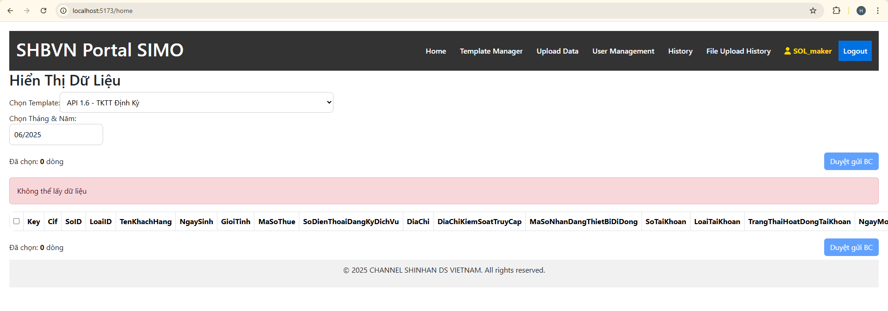

# Deploy SIMO Website Manual

**Author**: Hau Pham  
**Date**: July 2025

---

## Introduction

- SIMO System  
- Deploy: Use Docker platform to deploy  

---

## Tool and Version

- Docker Desktop 4.40.0 (187762)  
- VPN Client - Connect with VPN of SIMO  
  

---

## Docker Image and Source Code

**Image Source**: [Docker Hub](https://hub.docker.com/u/phamphuchau28)

- Frontend Image: [simo_frontend_img](https://hub.docker.com/r/phamphuchau28/simo_frontend_img)
- Backend Image: [simo_backend_img](https://hub.docker.com/r/phamphuchau28/simo_backend_img)

**Source Code**: [GitHub Repo](https://github.com/PhamPhucHau/SYSTEM-REPORT-SIMO-GATEWATE.git)

> You must build the frontend image with the backend API URL:

```bash
docker build   --build-arg VITE_SIMO_APP_API_URL=http://localhost:8081   -t phamphuchau28/simo_frontend_img:latest .
```


---

## Folder Directory

```
\Deploy\
├── .prod_env
├── docker-compose.prod.yml
├── run_prod.sh
├── stop_prod.sh
```

**Note**: Grant full permission with:

```bash
icacls "D:\Deploy" /grant Administrator:F /t
```

---

## Environment Config

Defined in `.prod_env` file:

| Key | Explanation |
|-----|-------------|
| `SPRING_PROFILES_ACTIVE=prod` | Activates the Spring Boot `prod` profile |
| `MONGO_URI` | MongoDB connection string |
| `APP_USER` | External API user |
| `APP_PASSWORD` | Password for `APP_USER` |
| `APP_KEY` | External API key |
| `APP_SECRET` | Secret for `APP_KEY` |
| `SIMO_CONSUMER_KEY` | SIMO API key |
| `SIMO_CONSUMER_SECRET` | SIMO API secret |
| `SIMO_URL` | SIMO API endpoint |
| `MONGO_DATA_PATH` | MongoDB data path on host |
| `MONGO_INIT_PATH` | Mongo init scripts path |
| `SERVER_PORT` | Spring Boot port |
| `FRONTEND_DOMAIN` | CORS domain |
| `LOG_DIR` | Log directory |
| `UPLOAD_DIR` | Container upload folder |
| `UPLOAD_DATA=./UPLOAD_DATA/PROD` | Host mount path for upload |

---

## Deployment

### Upload Folder Deploy

Upload `Deploy_Production.zip` to the server  


---

### Add DNS to Linux `/etc/hosts`

```bash
202.58.245.127	mgsimo.sbv.gov.vn
202.58.245.128	simo.sbv.gov.vn
202.58.245.129	msimo.sbv.gov.vn
```

---

### Run Production Environment

#### Import Docker Images


```bash
docker load -i simo_all.tar
```

Change directory to Deploy folder:

```bash
cd <path-to-deploy-folder>
bash ./run_prod.sh
```

Or double-click `run_prod.bat`.

  


---

## Monitoring

- **Frontend**: `http://<domain>:5173`  
  

- **Backend Health Check**:  
  `http://<IP>:8081/actuator/health`

- **MongoDB Access (MongoDB Compass)**:  
  `mongodb://admin:admin123@<IP>:27017`  
  

---

## Troubleshooting

### Port Already In Use

1. Find the process using port (e.g., 5173):

```bash
netstat -ano | findstr ":5173"
```


2. Find the process name:

```bash
tasklist /FI "PID eq <PID>"
```


3. Kill the process:

```bash
taskkill /PID <PID> -F
```


---